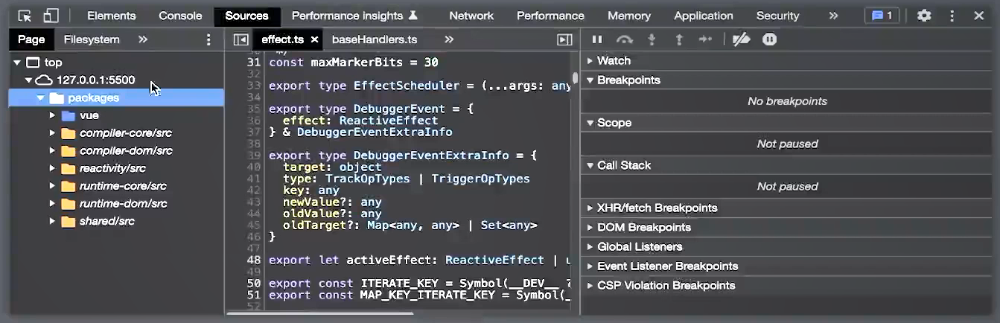
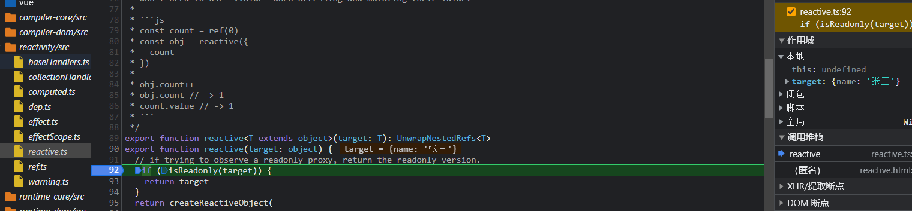
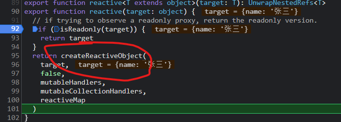
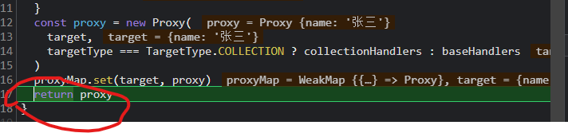

# 第三章：Vue3 源码结构 - 搭建框架雏形

### 01：前言

从本章开始我们将要去搭建自己的 vue 框架项目，叫做 `vue-next-mini`。

在搭建的过程中，我们将参考 `vue` 源码的项目结构与构建方案，从而可以构建出一个 **小而美** 的 `vue` 框架。

所以本章的内容将会分为两个大的部分：

1. `vue` 源码解析：在这部分，我们需要下载 `vue` 的源代码，同时对它进行 `debuger` 和 `源码阅读`
2. 构建 `vue-next-mini`：在这部分，我们会参考 `vue` 源代码的基本结构，来创建我们自己的 `vue-next-mini`
3. 那么明确好了以上内容之后，接下来就让我们来开始本章的学习吧。


### 02: 探索源码设计： Vue3 源码设计大解析

在本小节中，我们需要做两件事情：

1. 下载 `vue` 源码（版本： v3.2.37）
2. 了解 `vue` 的源码结构

下载好 Vue 源码之后，我们来看下它的基本结构

```js
vue-next-3.2.37-master
|—— tsconfig.json // TypeScript配置文件
|—— rollup.config.js // rollup 的配置文件
|—— packages // 核心代码区
|		|—— vue-compat // 用于兼容 vue2 的代码
|		|—— vue // 重要：测试实例、打包之后的 dist 都会放在这里
|		|—— template-explorer // 提供了一个线上的测试 (https://template-explorer.vuejs.org)，用于把 template 转换为 render
|		|—— size-check // 测试运行时包大小
|		|—— shared // 重要： 共享的工具类
|		|—— sfc-playground // sfc 工具，比如：https://sfc.vuejs.org/
|		|—— server-renderer // 服务器渲染
|		|—— runtime-test // runtime 测试相关
|		|—— runtime-dom // 重要：基于浏览器平台的运行时
|		|—— runtime-core // 重要：运行时的核心代码，内部针对不同平台进行了实现
|		|—— reactivity-transform // 已过期，无需关注
|		|—— reactivity // 重要：响应性的核心模块
|		|—— global.d.ts // 全局的 ts 声明
|		|—— compiler-ssr // 服务端渲染的编译模块
|		|—— compiler-sfc // 单文件组件 (.vue) 的编译模块
|		|—— compiler-dom // 重要：浏览器相关的编译模块
|		|—— compiler-core // 重要：编译器核心代码
|—— package.json // npm 包管理工具
|—— netlify.toml // 自动化部署相关
|—— jset.config.js //测试相关
|—— api-extractor.json // TypeScript 的 API 分析工具
|—— SECURITY.md // 报告漏洞，维护安全的声明文件
|—— README.md // 项目声明文件
|—— LICENSE // 开源协议
|—— CHANGELOG.md // 更新日志
|—— BACKERS.md // 赞助声明
|—— test-dts // 测试相关，不需要关注
|—— scripts // 配置文件相关，不需要关注
|—— pnpm-workspace.yaml // pnpm 相关配置
|—— pnpm-lock.yaml // 使用 pnpm 下载的依赖包版本
```


### 03: 创建测试实例： 在 Vue 源码中运行测试实例

那么现在我们已经大致的了解了 `vue` 源代码的基本结构，那么接下来我们来看一下，如何在 vue3 的代码中运行测试实例，并运行 `debugger`

#### 运行 vue3 源代码

1. 因为 vue3 是通过 `pnpm` 作为包管理工具的，所以想要运行 `vue3` 那么首先需要 **安装** `pnpm`

2. 我们可以直接通过如下指令安装 `pnpm`

   ```shell
   npm install -g pnpm
   ```

3. `pnpm` 会通过一个 **集中管理** 的方式来管理 **电脑中所有项目** 的依赖包，以达到 **节约电脑磁盘** 的目的，具体可查看 [pnpm文档](https://www.pnpm.cn/motivation)

4. 安装完 `pnmp` 之后，接下来就可以在 **项目根目录** 下通过：

   ```shell
   pnpm i
   ```

   的形式安装依赖

5. 等待所有的依赖包安装完成之后，执行：

   ```shell
   npm run build
   ```

6. 执行完成之后，可以发现在 `packages/vue/dist/` 下，生成如下文件

   ```
   dist
   |—— vue.cjs.js
   |—— vue.cjs.prod.js
   |—— vue.esm-browser.js
   |—— vue.esm.browser.prod.js
   |—— vue.esm.bundler.js
   |—— vue.global.js
   |—— vue.global.prod.js
   |—— vue.runtime.esm.browser.js
   |—— vue.runtime.esm.browser.prod.js
   |—— vue.runtime.esm-bundler.js
   |—— vue.runtime.global.js
   |—— vue.runtime.global.prod.js
   ```

7. 那么至此，项目打包完成

#### 运行测试实例

之前的时候说过 `packages/vue/examples` 下放的是测试的实例，所以我们可以在这里新建一个文件夹，用来表示代码的测试实例。

1. 创建 `packages/vue/examples/imooc/reactivity` 文件夹

2. 在该文件夹中创建第一个测试实例：`reactive.html`，并写入如下代码（这些代码大家可能会不太理解，没有关系！后面会进行详细讲解，这里只是为了测试 vue 代码的 debugger）：

   ```html
   <!DOCTYPE html>
   <html lang="en">
     <head>
       <meta charset="UTF-8" />
       <meta http-equiv="X-UA-Compatible" content="IE=edge" />
       <meta name="viewport" content="width=device-width, initial-scale=1.0" />
       <title>Document</title>
       <script src="../../../dist/vue.global.js"></script>
     </head>
   
     <body>
       <div id="app"></div>
     </body>
     <script>
       // 从 vue 中解构出 reactive、effect 方法
       const { reactive, effect } = Vue
       
       // 声明响应式数据 obj
       const obj = reactive({
         name: '张三'
       })
   
       // 调用 effect 方法
       effect(() => {
         document.querySelector('#app').innerText = obj.name
       })
   
       // 定时修改数据，视图发生变化
       setTimeout(() => {
         obj.name = '李四'
       }, 2000)
     </script>
   </html>
   
   ```

3. 注意：**该代码不可以直接放入到浏览器中运行**。

4. 使用 vscode 的插件打开本地服务


### 04：跟踪解析运行行为：为 vue 开启 SourceMap

此时，我们已经成功的运行了一个测试实例代码，但是在这样的一个测试实例代码中，Vue 内部是如何执行的呢？

如果想要知道这个，那么我们需要对 `vue` 的代码进行 `debugger` 来跟踪 `vue` 代码的执行。

那么问题来了，**如何对 `Vue` 进行 `debugger` 操作呢？**

如果想要对 `vue` 进行 `debugger` 操作，那么我们必须要开启 `vue` 的 `source-map` 功能

#### 开启 Vue 的 SourceMap

如何开启 `vue` 的 `source-map` 呢？

1. 打开 `package.json` 可以发现，当我们执行 `npm run build` 时，其实执行的是 `node scripts/build.js` 指令

2. 这就意味着，它的配置文件读取的是 `scripts/build.js` 这个文件

3. 那么在该文件中存在这样的一行代码：

   ```js
   ...
   sourceMap ? `SOURCE_MAP:true` : ``
   ...
   ```

4. 也就是说，这里的 `sourceMap` 变量，决定了 `SOURCE_MAP:true` 还是 ''

5. 而这个值，最终会被设置到环境变量中，在 `rollup.config.js` 中，通过：

   

   ```js
    output.sourcemap = !!process.env.SOURCE_MAP
   ```

   的形式，赋值给 `output.soucremap`

6. 而 `output.sourcemap` 则决定了，最终的打包，是否会包含 `source-map`:

   ```json
   sourceMap:output.sourcemap
   ```

7. 所以， 根据以上代码，只要 `scripts/build.js` 中的 `sourceMap` 变量的值为 `true`，则最终会打包包含 `sourcemap` 的包。

8. 那么 `sourceMap` 变量的值是如何确定的呢？

9. 在 `scripts/build.js` 中，我们可以看到如下代码：

   ```js
   const sourceMap = args.sourcemap || args.s
   ```

10. 而 `args` 的值为：

    ```js
    const args = require('minimist')(process.argv.slice(2))
    ```

11. 从代码可知，`args` 是 `minimist` 的导出对象

12. 所以我们需要看下 [minimist](https://www.npmjs.com/package/minimist) 这个依赖包是干什么呢？

13. 根据官网的实例代码可知：

    ```shell
    var argv = require('minimist')(process.argv.slice(2));
    console.log(argv);
    
    $ node example/parse.js -a beep -b boop
    { _: [], a: 'beep', b: 'boop' }
    ```

14. 我们可以在执行 `npx` 指令时，通过 `-a beep` 的形式为 `require('minimist')(process.argv.slice(2));` 导出的值增加属性

15. 所以，根据以上代码，我们可以在 `package.json` 中修改 `build` 指令为：

    ```json
    "build": "node scripts/build.js -s true",
    ```

16. 其中的 `-s` 表示：我们将为 `scripts/build.js` 文件中的 `args` 新增一个属性 `s`

17. 而这个 `s` 决定 `sourceMap` 常量的值为 `true`

18. 此时，我们在执行 `npm run build` 可以发现，打包出的所有文件都将包含一个 `xxxx.map` 文件

19. 这样我们就开启了源代码的 `source-map`

20. 有了 `source-map` 之后，接下来我们就可以对代码进行 `debugger` 了


### 05：授人以鱼：如何对源码进行 debugger

此时我们已经成功的开启了 `SourceMap`，那么开启了 `sourceMap` 之后有什么改变呢？

此时再来看刚才启动的项目。



其中左侧所展示的，就是当前使用到的 `vue` 源代码。

那么我们知道此时我们是使用了 `reactive` 方法声明的响应式数据， `reactive` 方法对应的代码位置在 `packages/reactivity/src/reactive.ts` 中第 90 行：



那么此时我们就可以在这里打上一个断点，来跟踪这个 `reactive` 的代码执行逻辑。

刷新页面，可以看到，此时代码已经进入了 `debugger`

那么这样我们就成功的为 `vue` 的测试实例开启了 `debugger` 功能，后序我们的开发之中，就可以利用这样的方式，来跟踪并查看 `vue` 源码的执行逻辑。

#### 总结

想要对 `vue` 代码执行 `debugger` 那么共分为以下步骤：

1. 下载 `vue` 源代码，推荐使用 git 的代码仓库下载
2. 为源代码开启 `sourcemap`，以方便后续进行 `debugger`
3. 在 `packages/vue/examples` 中，创建文件，导入 `../../dist/vue.global.js` 书写测试实例
4. 通过 `Live Server` 启动服务
5. 在浏览器控制台的 `Sources` 中查看运行代码，并进行 `debugger`


### 06：授人以渔：如何阅读源码

那么在上一小节中我们已经知道了如何对 `vue` 的源代码进行 `debugger`，但是如果想要学习或者了解 `vue` 的代码执行，那么光靠 `debugger` 是不够的，除此职位我们还需掌握另外一个能力，那就是 **如何阅读源代码。**

#### 阅读源代码的误区

很多人在阅读源代码的时候，都会面临一个 **误区，** 那就是：**我们要把源代码中每一行代码都读明白。**

这是一个非常不对的行为，很容易让我们 **事倍功半**

所以在这里我们需要先给大家明确一点：**阅读源码绝对不是要读明白其中每一行代码的意思，而是在众多的业务代码中寻找到主线，跟随这个主线来进行阅读**


#### 阅读源码的正确姿势

想要快速、轻松的阅读源码，正确的姿势非常重要，主要有两点：

1. 摒弃边缘情况
2. 跟随一条主线


#### 摒弃边缘情况

在大型项目的源码中，都会充斥着非常多的业务代码，这些业务代码是用来处理很多 **边缘情况的**，如果我们过分深究这些业务代码则会让我们陷入到一个 **代码泥潭** 中，在繁琐的业务中找不到方向。

所以，我们在阅读源码之前，必须要明确号一点，那就是：**仅阅读核心逻辑**


#### 跟随一条主线

对于向 `vue` 这种量级的项目来说，哪怕我们只去阅读它的核心代码，你也会发现同样很困难。我们之前说过，`vue` 的核心大致可以分为三块：

1. 响应性
2. 运行时
3. 编译器

每一块的内部又分为了很多的业务分支。所以哪怕仅阅读核心代码已然是一个浩大的工作量。

所以说我们还需要另外一个方式，那就是：**跟随一条主线**

> 举个例子：我们以前面的 packages/vue/examples/imooc/reactive.html 为例

在该代码中，我们通过 `reactive` 声明了一个响应式数据：

```js
// 声明响应式数据 obj
const obj = reactive({
  name: '张三'
})
```

那么我们就可以以该代码为主线，去查看 `reactive` 方法的主线逻辑：

1. 首先在 `reactive` 方法中进行了一个逻辑判断，判断 `target` 是否为只读的，如果是只读的就直接返回 `target`，意思是：传的是啥返回啥

2. 如果不是只读的，则触发 `createReactiveObject` 方法

   

3. 在 `createReactiveObject` 方法中，又进行了一堆判断，最后返回了 `proxy` 实例对象，所以我们得到的 obj 应该就是一个 `proxy` 对象

   

4. 打印 `obj` 就会发现确实如此

这样的一个简单的例子，就是告诉大家应该如何来通过 `debugger` **配合** 正确姿势 来快速的阅读源代码。

#### 总结

这一小节我们讲解了 **如何阅读源代码，** 以上方式不仅仅可以应用到 `vue` 中，也可以应用到其他的框架之中。

当然，这里只是一个简单的方式进行了举例，在实际的阅读源码过程中，肯定还是会遇到很多的困难的。


### 07：开始搭建自己的框架：创建 vue-next-mini

那么经过我们现在的学习，我们大概已经了解了 `Vue` 源码中的一些大概模块，并且也知道了如何对 `vue` 的代码进行实例测试、代码跟踪与代码阅读

那么明确了这些之后，接下来我们就可以创建咱们自己的 `vue` 框架项目：`vue-next-mini`

创建 `vue-next-mini` 与我们之前创建项目不同，不可以再借助 `vue-cli` 或 `vite` 等脚手架工具快速生成 `vue` 项目基本结构了，所以我们需要从 0 来搭建这样的一个项目。

1. 创建 `vue-next-mini` 文件夹

2. 通过 `VSCode` 打开

3. 在终端中，通过

   ```shell
   npm init -y
   ```

   创建 `package.json` 模块

4. 创建 `packages` 文件夹，作为：**核心代码** 区域

5. 创建 `packages/vue` 文件夹：打包、测试实例、项目整体入口模块

6. 创建 `packages/shared` 文件夹：共享公共方法模块

7. 创建 `packages/compiler-core` 文件夹，编辑器核心模块

8. 创建 `packages/compiler-dom` 文件夹，浏览器部分编辑器模块

9. 创建 `packages/reactivity` 文件夹：响应性模块

10. 创建 `packages/runtime-core` 文件夹：运行时核心模块

11. 创建 `packages/runtime-dom` 文件夹：浏览器部分运行时模块

因为 `Vue3` 是使用 `TS` 进行构建的，所以在我们的项目中，也将通过 `TS` 进行构建整个项目，那么我们又如何在项目中使用 `ts` 呢？下一节讨论


### 08：为框架进行配置：导入 `ts`

想要在项目中使用 `ts` 配置（课程中使用 4.7.4 版本的 `ts`），那么首先我们在项目中创建对应的 `tsconfig.json` 配置文件。

1. 在项目根目录中，创建 `tsconfig.json` 文件。

2. 该 `tsconfig.json` 文件指定编译项目所需要的 **入口文件** 和 **编译器** 配置

3. 我们也可以通过以下指令来生成 **包含默认配置** 的 `tsconfig.json` 文件：

   ```shell
   // 先安装 typescript@4.7.4
   npm i -g typescript@4.7.4
   
   // 生成默认配置
   tsc --init
   ```

4. 在 `tsconfig.json` 中指定如下配置：

   ```json
   {
     "compilerOptions": {
       /* Visit https://aka.ms/tsconfig to read more about this file */
       "target": "ES5",
       "module": "ESNext",
       "lib": [
         "ESNext",
         "DOM"
       ],
       "rootDir": ".",
       "moduleResolution": "node",
       "resolveJsonModule": true,
       "sourceMap": false,
       "removeComments": false,
       "downlevelIteration": true,
       "esModuleInterop": true,
       "forceConsistentCasingInFileNames": true,
       "strict": true,
       "noUnusedLocals": false,
       "noUnusedParameters": false,
       "noImplicitAny": false,
       "skipLibCheck": true,
       // 设置快捷导入
       "baseUrl": ".",
       "paths": {
         "@vue/*": [
           "packages/*/src"
         ]
       }
     },
     "include": [
       "packages/*/src"
     ]
   }
   ```


### 09：引入代码格式工具：prettier 让你的代码结构更加规范

因为对于 `vue` 而言，它是一个开源的可以被众多开发者贡献的框架项目，所以为了保证整个项目的代码书写具备同一风格，`vue` 导入了 `eslint` 和 `prettier` 进行代码格式控制。

但是对于我们而言，因为这并不是一个开源的代码仓库，所以我们无需专门导入 `eslint` 增加项目的额外复杂度，只需要导入 `prettier` 帮助我们控制代码格式即可。

1. 在 `VSCode` 扩展中，安装 `prettier` 辅助插件

2. 在项目根目录，创建 `.prettierrc` 文件

   ```js
   {
     // 结尾无分号
     "semi":false,
     // 全部使用单引号
     "singleQuote": true,
     // 每行长度为 80
     "printWidth": 80,
     // 不添加尾随 , 号
     "trailingComma": "none",
     // 省略箭头好书括号
     "arrowParens": "avoid"
   }
   ```

   

3.  支持配置完成


### 10：模块打包器：rollup

`rollup` 是一个模块打包器，和 `webpack` 一样可以将 `JavaScript` 打包为指定的模块。

但是不同的是，对于 `webpack` 而言，它在打包的时候会产生许多 **冗余的代码**，这样的一种情况在我们开发大型项目的时候没有什么影响，但是如果我们是开发一个 **库** 的时候，那么这些冗余的代码就会大大增加库体积，这就不美好了。

所以说我们需要一个 **小而美** 的模块打包器，这就是 `rollup`:

> Rollup 是一个 `JavaScript` 模块打包器，可以将小块代码编译成大块复杂的代码，例如 library 或应用程序。

因为 `rollup` 并不是咱们课程的重点，所以我们不会发费大量的篇幅来讲解 `rollup` 的概念，只会讲解 `rollup` 的一些基础概念，能够满足我们当前的使用即可。大家可以把 `rollup` 理解为一个打包 **库** 的模块打包器，而在应用程序的打包中选择 `webpack`。

#### rollup

我们可以在项目根目录下，创建 `rollup.config.js` 文件作为 `rollup` 的配置文件（就像webpack.config.js 一样）：

```js
import resolve from '@rollup/plugin-node-resolve'
import commonjs from '@rollup/plugin-commonjs'
import typescript from '@rollup/plugin-typescript'

export default [
  {
    // 入口文件
    input: 'packages/vue/src/index.ts',
    // 打包出口
    output: [
      // 导出 iife 模式的包
      {
        // 开启 sourceMap
        sourcemap: true,
        // 导出文件地址
        file: './packages/vue/dist/vue.js',
        // 生成包的格式
        format: 'iife',
        // 变量名
        name: 'Vue'
      }
    ],
    // 插件
    plugins: [
      // ts
      typescript({
        sourceMap: true
      }),
      // 模块导入的路径补全
      resolve(),
      // 转 commonjs 为 ESM
      commonjs()
    ]
  }
]

```

依赖包的详细版本为：

```json
 "devDependencies": {
    "@rollup/plugin-commonjs": "^22.0.1",
    "@rollup/plugin-node-resolve": "^13.3.0",
    "@rollup/plugin-typescript": "^8.3.4",
	｝
```

那么至此我们就配置了一个基本的 `rollup` 的配置文件

然后我们可以在 `input` 路径下创建对应的 `index.ts`，并写入初识代码：

```js
console.log('hello vue-next-mini')
```

同时因为我们使用的是 `ts` ，所以还需要安装：`tslib typescript`:

```
npm install -D tslib@2.4.0 typescript@4.7.4
```

那么此时，所有的配置完成

此时我们可以在 `package.json` 中新增一个 `scripts`：

```json
		"build": "rollup -c"
```


### 11: 初见框架雏形：配置路径映射

我们知道在当前的项目中，`shared` 文件夹内承担的是公开的工具方法，比如我们可以创建如下文件：`packages/shared/src`

```js
/**
*	判断是否为一个数组
**/
export const isArray = Array.isArray
```

那么这个方法可能会在项目的多个地方被使用，所以我们可能会经常使用到如下代码

`packages/vue/src/index.ts`:

```js
import { isArray } from '@vue/shared'

console.log(isArray([]))
```

其中我们期望可以通过 `@vue/shared` 来直接导入 `packages/shared/src/index.ts` 下的 `isArray`方法。

那么如果想要达到这样的效果，那么就必须要设置 `tsconfig` 的 **路径映射** 功能。

在 `tsconfig.json` 中添加如下代码：

```json
{
  "compilerOptions":{
     // 设置快捷导入
    "baseUrl": ".",
    "paths": {
      "@vue/*": [
        "packages/*/src"
      ]
  }
}
```

这表示，我们可以通过 `@vue/*` 代替 `packages/*/src/index` 的路径

那么此时，我们的导入即可完成，可重新执行 `npm run build` 进行测试


### 12： 总结

在本章中，我们主要做了两件事情：

1. 了解了 `vue` 的源码设计，同时也知道如何阅读框架的源代码，并且对 `vue` 的源码进行了 `debugger`
2. 创建了咱们自己的 `vue-next-mini` 库，并且对该项目进行了结构和配置上的初始化

那么做完了这些之后，从下一章我们就要开始逐步的接触到 `vue` 的核心的代码和设计内容，并且逐步实现 `vue-next-mini` 了。
