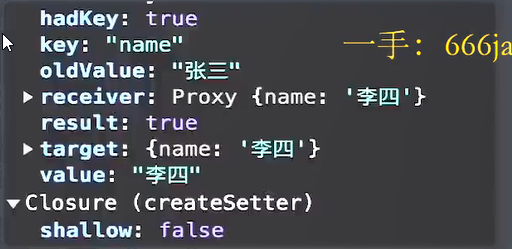
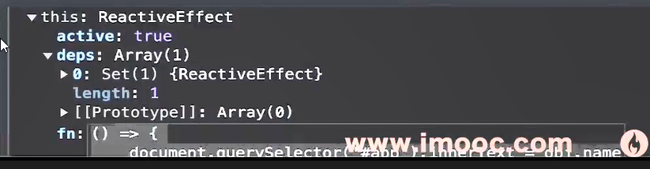
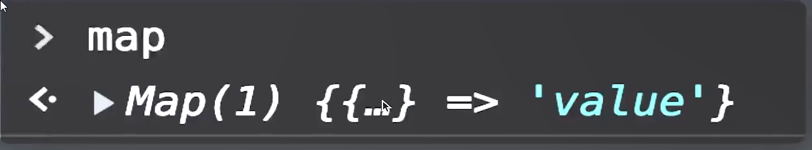
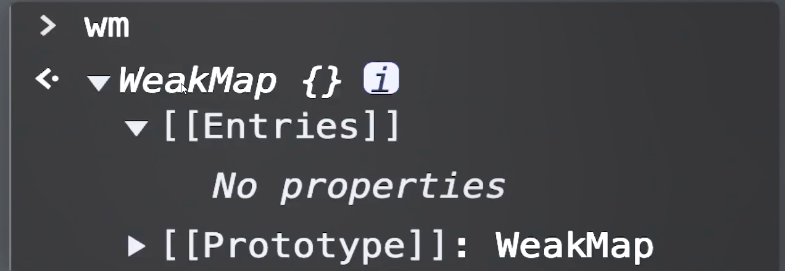
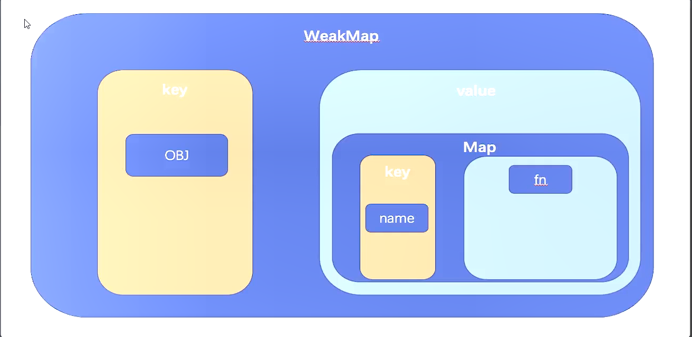
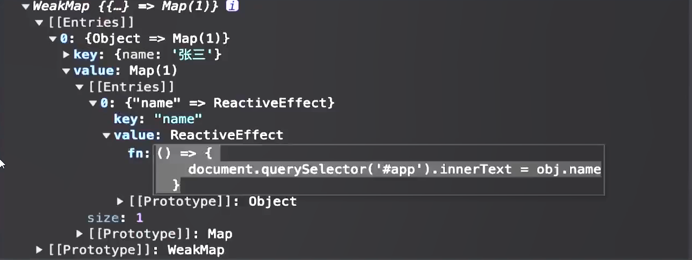
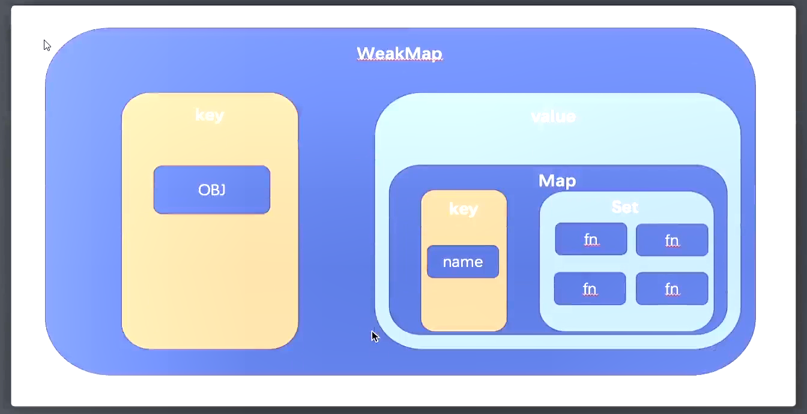

# 第五章：响应系统 - 初见 reactivity 模块

### 01：前言

从本章开始我们将开始实现 `Vue3` 中的 `reactivity` 模块，该模块中，将会利用我们在上一章中学到的知识实现响应性数据，如：

1. reactive
2. ref
3. computed
4. watch

等等

在这些代码的实现中，我们将会参考 `vue` 的源代码，并在其基础上进行一些适当的 **简化** 和 **修改**。以此来帮助大家掌握 `vue3` 中响应式的核心逻辑。

那么明确好了这些内容之后，接下来让我们进入到响应式的实现之中吧。


### 02：源码阅读：reactive 的响应性，跟踪 Vue3 源码实现逻辑

我们知道在 `vue` 中想要实现响应式数据，拥有两种方式：

1. ==reactive==
2. ==ref==

在第三章中，我们在 `vue` 的源码中，创建了 ==package/vue/examples/imooc/reactive.html== 测试实例，在该实例中，我们通过 `reactive` 方法声明了一个响应式数据，通过 `effect` 注册了一个函数。

那么下面，我们就 **跟踪** 当前的代码，来详细看一下 `vue` 内容到底做了什么？

看的过程中我们需要时刻记住两点主线：

1. `reactive` 做了什么？
2. `effect` 是什么？

明确好了之后，那么下面我们来去看：

#### reactive 方法

1. 触发 `reactive` 方法
2. 创建 `reactive` 对象：`return createReactiveObject`
3. 进入 `new Proxy`
   1. 第一个参数 `target`：为传入的对象
   2. 第二个参数 `handler` ：`TargetType.COLLECTION = 2`, `targetType = 1`, 所以 handler为 `baseHandlers`
   3. 那么这个 `baseHandlers` 是什么呢？
4. 在 `reactive` 方法中可知，`baseHandlers`是触发 `createReactiveObject` 传递的第三个参数：`mutableHandlers`
5. 而 `mutableHandlers` 则是 ==packages/reactivity/src/baseHandlers.ts== 中导出的对象
6. 所以我们到 ==packages/reactivity/src/baseHandlers== 中，为它的 `get` (createGetter) 和 `set`(createSetter) 分别打入一个断点
7. 我们知道 `get`和 `set` 会在 **取值** 和 **赋值** 时触发，所以此时这两个断点 **不会执行**
8. 最后 `reactive` 方法内执行了 `proxyMap.set(target, proxy)` 方法
9. 最后返回了代理对象
10. 那么至此 `reactive` 方法执行完成。

由以上执行逻辑可知，对于 `reactive`方法而言，其实做的事情非常简单：

1. 创建了 `proxy`
2. 把 `proxy` 加到了 `proxyMap`
3. 最后返回了 `proxy`

#### effect

那么接下来我们看 `effect`:

1. 在 ==packages/reactivity/src/effect.ts== 第 170 行可以找到 `effect` 方法，在这里给一个断点

2. 执行 `new ReactiveEffect(fn)`，其中的 `fn` 就是我们传入的匿名函数：

   1. 这里涉及到了一个类 `ReactiveEffect`
   2. 查看该类可知，内部实现了两个方法：
      1. `run`
      2. `stop`
   3. 我们分别为这两个方法 **增加断点**

3. 代码继续执行

4. 可以发现执行了 `run` 方法，进入方法内部：

   1. 执行 `activeEffect = this`，赋值完成之后，`activeEffect` 为 **传入的匿名函数** `fn`

   2. 然后执行 `return this.fn()` 触发 `fn` 函数

   3. 我们知道 `fn` 函数其实就是 **传入的匿名函数**，所以就是

      `document.querySelector('#app').innerText = obj.name`

5. 但是大家不要忘记，`obj` 是一个 `proxy`，`obj.name` 会触发 `getter`，所以接下来我们就会进入到 `mutableHandlers` 的 `createGetter` 中

   1. 在该代码中，触发了该方法 `const res = Reflect.get(target, key, receiver)`
   2. 此时的 `res` 即为 **张三**
   3. **注意**： 接下来触发了 `track` 函数，该函数是一个重点函数，`track` 在此为 **跟踪** 的意思，我们来看下它内部都做了什么：

      1. 在 4-1 步中，为 `activeEffect` 进行了赋值，我们知道 `activeEffect` 代表的就是 `fn` 函数
   2. 执行代码可知，`track` 内部做了两件事情：
      
      1. 为 `targetMap` 进行赋值，`targetMap` 的组成比较复杂：
      
         1. `key: target`
            2. `value: Map`
               1. `key: key`
               2. `value: Set`
         2. 最后执行了 `track  ffects(dep, eventInfo)`
      
            1. 其中 `eventInfo` 是一个对象，内部包含四个属性：其中 `effect` 即为 `activeEffect` **即 `fn` 函数**
      3. 在 `trackEffects` 函数内部，核心也是做了两件事情：
      
         1. 为 `dep` (`targetMap[target][key] `得到的 `Set` 实例)	添加了 `activeEffect` 函数
            2. 为 `activeEffect` 函数的 **静态属性** `deps` ，增加了一个值 `dep`
         3. 即：**建立起了 `dep`  和 `activeEffect` 的联系**
   4. 那么至此，整个 `track` 的核心逻辑执行完成
   5. 我们可以把整个 `track` 的核心逻辑说成：**收集了 `activeEffect` （即：`fn`）**

6. 最后在 `createGetter` 函数中返回了 `res`（即：张三）

7. 至此，整个 `effect` 执行完成

由以上逻辑可知，**整个 `effect` 主要做了 3 件事情**

1. 生成 `ReactiveEffect`实例
2. 触发 `fn` 方法，从而激活 `getter`
3. 建立了 `targetMap` 和 `activeEffect` 之间的联系
   1. `dep.add(activeEffect)`
   2. `activeEffect.deps.push(dep)`

那么至此 **页面即可 展示 `obj.name`**，但是不要忘记，等待两秒之后，我们会修改 `obj.name` 的值，我们知道：这样会触发 `setter`，那么我们接下来来看 `setter` 中又做了什么呢？

1. 两秒之后触发 `setter`，会进入到==packages/reactivity/src/baseHandlers.ts==中的 `createSetter` 方法中

2. 创建变量：`oldValue = 张三`

3. 创建变量：`value = 李四`

4. 执行 `const result = Reflect.set(target, key, value, receiver)` ，即：修改了 `obj` 的值为 “李四”

5. 触发：`trigger(target, TriggerOpTypes.SET, key, value, oldValue)`，此时各参数的值为：

   

6. `trigger` 在这里为 **触发** 的意思，那么我们来看 `trigger` 内部做了什么？

   1. 首先执行：`const depsMap = targetaMap.get(target)`，其中 `targetMap` 即我们在 `track` 函数中，保存 `activeEffect` 的 `targetMap`

   2. 然后执行到： `deps.push(depsMap.get(key))`。`depsMap.get(key)` 获取到的即为之前保存的 `activeEffect`，即 `fn` 函数

   3. 然后触发 `triggerEffects(deps[0], eventInfo)`，我们来看 `triggerEffects`中做了什么：

      1. 声明常量：`const effects = isArray(dep) ? dep : [...dep]`，此时 `effects` 保存的为 `fn` 的集合

      2. 遍历 `effects`，执行：`triggerEffect(effect, debuggerEventExtraInfo)` 方法，那么我们来看 `triggerEffect` 做了什么

         1. 执行 `effect.run()` 方法，已知：`effect` 是一个 `ReactiveEffect` 类型的对象，则 `run` 方法会触发 `ReactiveEffect` 的 `run`，那么我们接下来来看 **这一次** 进入 `run` 方法时，内部做了什么？

            1. 首先还是为 `activeEffect = this` 赋值，但是要 **注意**：此时的 `this` 不再是一个 `fn`，而是一个车复杂对象：

               

            2. 最后执行 `this.fn()`，即：`effect` 时传入的匿名函数

            3. 至此，`fn`执行，意味着：`document.querySelector('#app').innerText = '李四'`，**页面将发生变化**

      3. `triggerEffect` 完成

   4. `triggerEffects` 完成

7. `trigger` 完成

8. `setter` 回调完成


#### 总结

那么到这里，我们就整个的跟踪了 ==pacakages/vue/examples/imooc/reactive.html== 实例中：

1. `reactive` 函数
2. `effect` 函数
3. `obj.name = xx` 表达式

这三块代码背后，`vue` 究竟都做了什么。虽然整个的过程比较复杂，但是如果我们简单来去看，其实内部的完成还是比较简单的：

1.  创建 `proxy`
2. 收集 `effect` 的依赖
3. 触发收集的依赖

那么接下来我们就自己的实现，将会围绕着这三个核心的理念进行。

****

### 03： 框架实现：构建 `reactive` 函数，获取 `proxy`实例

根据上一一节的内容可知，整个 `reactive` 函数，本质上是返回了一个 `proxy` 实例，那么我们这一小节，就先去实现这个 `reactive` 函数，得到 `proxy` 实例。

1. 创建 `packages/reactivity/src/reactive.ts` 模块：

   ```typescript
   import { mutableHandlers } from './baseHandlers'
   
   /**
    * 响应性 Map 缓存对象
    * key: target
    * val: proxy
    */
   export const reactiveMap = new WeakMap<object, any>()
   
   /**
    * 为复杂数据类型，创建响应性对象
    * @param target 被代理对象
    * @returns 代理对象
    */
   export function reactive (target: object) {
     return createReactiveObject(target, mutableHandlers, reactiveMap)
   }
   
   /**
    * 创建响应性对象
    * @param target 被代理对象
    * @param baseHandlers ProxyHandler 对象
    * @param proxyMap WeakMap 对象
    * @returns 代理对象
    */
   function createReactiveObject (
     target: object,
     baseHandlers: ProxyHandler<any>,
     proxyMap: WeakMap<object, any>
   ) {
     // 如果该对象已经被代理，则直接读取即可
     const existingProxy = proxyMap.get(target)
     if (existingProxy) {
       return existingProxy
     }
   
     // 未代理对象则生成 proxy 实例
     const proxy = new Proxy(target, baseHandlers)
   
     // 缓存代理对象
     proxyMap.set(target, proxy)
     return proxy
   }
   ```

   

2. 创建 `packages/reactivity/src/baseHandlers.ts`  模块：

   ```typescript
   /**
    * 响应性的 handler
    */
   export const mutableHandlers: ProxyHandler<object> = {}
   ```

   

3. 那么此时我们就已经构建好了一个基本的 `reactive` 方法，接下来我们就可以通过 **测试案例** 测试一下。

4. 创建 `packages/reactivity/src/index.ts` 模块，作为 `reactivity` 的入口模块

   ```typescript
   export { reactive } from './reactive'
   ```

5. 在 `packages/vue/src/index.ts` 中，导入 `reactive` 模块

   ```typescript
   export { reactive } from '@vue/reactivity'
   ```

6. 执行 `npm run build` 进行打包，生成 `vue.js`

7. 创建 `packages/vue/examples/reactivity/reactive.html` 文件，作为测试实例：

   ```html
   <!DOCTYPE html>
   <html lang="en">
     <head>
       <meta charset="UTF-8" />
       <meta http-equiv="X-UA-Compatible" content="IE=edge" />
       <meta name="viewport" content="width=device-width, initial-scale=1.0" />
       <title>Document</title>
       <script src="../../dist//vue.js"></script>
     </head>
     <body></body>
     <script>
       const { reactive } = Vue
   
       const obj = reactive({
         name: '张三'
       })
   
       console.log(obj)
     </script>
   </html>
   ```

8. 运行到 `Live Server` 可见打印了一个 `proxy` 对象实例

那么至此我们已经得到了一个基础的 `reactive` 函数，但是在 `reactive` 函数中我们还存在三个问题：

1. `WeakMap` 是什么？它和 `Map` 有什么区别呢？
2. `mutableHandlers` 现在是一个空的，我们又应该如何实现呢？
3. 难不成以后每次测试时，都要打包一次吗？

那么我们一个一个来看 ~~~


### 04：框架实现：什么是 `WeakMap`？它和 `Map` 有什么区别？

对比 [WeakMap](https://developer.mozilla.org/zh-CN/docs/Web/JavaScript/Reference/Global_Objects/WeakMap) 和 [Map](https://developer.mozilla.org/zh-CN/docs/Web/JavaScript/Reference/Global_Objects/Map) 的文档可知，他们两个具备一个核心共同点，那就是：**都是  {key, value} 的结构对象**。

但是对于 `WeakMap` 而言，他却存在两个不同的地方：

1. `key` 必须是对象
2. `key` 是弱引用的

其中第一个不同点比较好理解，但是第二个不同点是什么意思呢？那么我们本小节就来看一下这个 **弱引用** 指的是什么？

> 概念
>
> 弱引用：不会影响垃圾回收机制。即：`WeakMap` 的 **不再存在任何引用时，**会被直接回收。
>
> 强引用：会影响垃圾回收机制。存在强引用的对象永远 **不会** 被回收。

我们来看下面两个例子：

```html
<script>
  // target 对象
  let obj = {
    name: '张三'
  }

  // 声明 Map 对象
  const map = new Map()

  // 保存键值对
  map.set(obj, 'value')

  // 把 obj 置空
  obj = null
</script>

```

在当前这段代码中，如果我们在浏览器控制台中，打印 `map` 那么打印结果如下：

​		

即：**虽然 `obj` 已经不存在任何引用了，但是它并没有被回收，依然存在于 Map 实例中。**这就证明 `Map` 是强引用的，哪怕 `obj` 手动 `null` ，但是它依然存在于 `Map` 实例中。

接下来同样的代码，我们来看 `WeakMap`：

```js
  // target 对象
  let obj = {
    name: '张三'
  }

  // 声明 WeakMap 对象
  const wm = new WeakMap()

  // 保存键值对
  wm.set(obj, 'value')

  // 把 obj 置空
  obj = null
```

在当前这段代码中，如果我们在浏览器控制台中，打印 `wm` ，那么打印结果如下：



此时 `WeakMap` 中不存在任何值，即：`obj` **不存在其他引用时，`WeakMap` 不会阻止垃圾回收，基于 `obj` 的引用将会被清除。**这就证明了 `WeakMap` 的 **弱引用特性。**

#### 总结

那么由以上可知，对于 `WeakMap` 而言，它存在两个比较重要的特效：

1. `key` 必须是对象
2. `key` 是弱引用的


### 05：框架实现：`createGetter` && `createSetter`

接下来我们看下 `mutableHandlers` ，对于当前的 `proxy` 而言，其实它是可以监听 `setter` 和 `getter` ，也就是说，我们需要在 `mutableHandlers` 去实现我们的 `getter` 和 `setter` 

其实就是两个方法：`get` 和 `set` 方法

1. 首先去处理 `get` ，其实它本质上是一个变量，它是 `createGetter() `的返回值

   ```typescript
   const get = createGetter()
   
   function createGetter () {
     return function get (target: object, key: string | symbol, receiver: object) {
       
       const res = Reflect.get(target, key, receiver)
   
       track(target, key)
   
       return res
     }
   }
   ```

   

2. 同理 `set` 也是 `createSetter()` 的返回值

   ```typescript
   const set = createSetter()
   
   function createSetter () {
     return function set (
       target: object,
       key: string | symbol,
       value: unknown,
       receiver: object
     ) {
       const res = Reflect.set(target, key, value, receiver)
   
       trigger(target, key, value)
   
       return res
     }
   }
   ```

   

3. 实现收集依赖和触发依赖

   ```typescript
   /**
    * 收集依赖
    * @param target
    * @param key
    */
   export function track (target: object, key: unknown) {
     console.log('track: 收集依赖')
   }
   
   /**
    * 触发依赖
    * @param target
    * @param key
    * @param newValue
    */
   export function trigger (target: object, key: unknown, newValue: unknown) {
     console.log('trigger: 触发依赖')
   }
   
   ```

   


### 06：热更新的开发时：提升开发体验

rollup 自带了热更新功能，添加新的 `scripts`即可开启：

```json
"scripts" : {
	"dev": "rollup -c -w"
}
```


### 07：框架实现：构建 `effect` 函数，生成 `ReactiveEffect` 实例

根据之前的测试实例我们知道，在创建好了 `reactive` 实例之后，接下来我们需要触发 `effect`:

```js
// 调用 effect 方法
effect(() => {
  document.querySelector('#app').innerText = obj.name
})
```

 根据 **第二节** 中查看的源码可知，在 `effect`中，我们生成了 `ReactiveEffect` 实例，并且触发了 `getter` 行为(obj.name)

那么接下来我们就要完成这一系列的操作。

1. 在 `packages/reactivity/src/effect.ts` 中，创建 `effect` 函数：

   ```typescript
   export function effect<T = any> (fn: () => T) {
     const _effect = new ReactiveEffect(fn)
     _effect.run()
   }
   
   export let activeEffect: ReactiveEffect | undefined
   
   export class ReactiveEffect<T = any> {
     constructor (public fn: () => {}) {}
   
     run () {
       activeEffect = this
   
       return this.fn()
     }
   }
   ```

2. 使用测试实例测试 effect:

   ```js
   <script>
       const { reactive, effect } = Vue
   
       const obj = reactive({
         name: '张三'
       })
   
       effect(() => {
         document.querySelector('#app').innerText = obj.name
       })
     </script>
   ```

   

那么此时，我们成功 **渲染了数据到 `html` 中**，那么接下来我们需要做的就是：**当 `obj.name` 触发 `setter` 时，修改视图**，以此就可以实现 **响应性数据变化。**

所以，下面我们就需要分别处理 `getter` 和 `setter` 对应的情况了。

### 08：框架实现：track && trigger

根据我们在 `packages/reactivity/src/baseHandlers.ts` 中的代码可知，当触发 `getter`行为时，其实我们会触发 `track` 方法，进行 **依赖收集，**当触发 `setter` 行为时，会触发 `trigger` 方法，来 **触发依赖**

那么这里就涉及到了两个概念：

1. 依赖收集：`track`
2. **触发依赖**： `trigger`

所以接下来如果我们想要实现这两个函数，那么就需要先搞清楚什么是 **依赖收集** 和 **依赖触发。**

#### 什么是响应性

根据大家的开发经验和我们在第二小节查看源码时可知，所谓的响应性其实指的就是：**当响应式数据触发 `setter` 时执行 `fn` 函数**

那么想要达到这样的一个目的，那就必须要在 `getter` **时能够收集当前的 `fn` 函数，以便在 `setter` 的时候可以执行对应的 `fn` 函数**

但是对于收集而言，如果仅仅是把 `fn` 存起来还是不够的，我们还需要知道，当前的这个 `fn` 是 **哪个响应式数据对象的哪个属性** 对应的，只有这样，我们才可以在 **该属性** 触发 `setter` 的时候，准确的执行响应性。

那么我们应该如何确定这一点呢？

#### 如何进行依赖收集

大家还记不记得，我们在 `packages/reactivity/src/reactive.ts` 中创建过一个 `WeakMap`:

```typescript
export const reactiveMap = new WeakMap<object, any>()
```

我们知道 `WeakMap` 它的 `key` 必须是一个对象，并且 `key` 是一个弱引用的。

那么大家想一想我们可不可以这样：

1. `WeakMap`:
   1. `key`: 响应式对象
   2. `value`: `Map` 对象
      1. `key`: 响应性对象的指定属性
      2. `value` 指定对象的指定属性的 **执行函数**

图表表示：

​			

那么这样我们就可以关联上 **指定对象的指定属性** 与 **执行函数 `fn` **之间的关系，当触发 `setter` 时，

就可以执行指定的 `fn` 函数

### 09：框架实现：构建 `track` 依赖收集函数

那么本小节，我们就来实现 `track` 函数，明确一下最终的目标，我们期望最终 `weakMap` 中可以保存以下结构数据：

`WeakMap`:

1. `key`：响应性对象
2. `value`：`Map` 对象
   1. `key` ：响应性对象的指定属性
   2. `value`：指定对象的指定属性的 **执行函数**

在 `packages/reactivity/src/effect.ts` 写入如下代码：

```typescript
type KeyToDepMap = Map<any, ReactiveEffect>
const targetMap = new WeakMap<any, KeyToDepMap>()


export function track (target: object, key: unknown) {
  if (!activeEffect) {
    return
  }
  let depsMap = targetMap.get(target)
  if (!depsMap) {
    depsMap = new Map()
    targetMap.set(target, depsMap)
  }

  depsMap.set(key, activeEffect)
  
  console.log(targetMap)
}
```

此时运行测试函数，查看打印的 `targetMap`，可得到以下数据：



那么此时证明，此时：**指定对象的指定属性对应的 `fn` 已经被成功的保存到了  `WeakMap` 中了。**

### 10：框架实现：构建 `trigger` 触发依赖

那么在上一小节中，我们已经成功保存依赖到 `WeakMap`中了，那么接下来我们就可以在 `setter` 的时候触发保存的依赖，依次来达到 `响应性` 数据的效果了。

在 `packages/reactivity/src/effect.ts` 中

```typescript
export function trigger (target: object, key: unknown, newValue: unknown) {
  // 依据 target 获取存储的 map 实例
  const depsMap = targetMap.get(target)

  // 如果 map 不存在，则直接 return
  if (!depsMap) return

  // 依据 key，从 depsMap 中取出 value，该 value 是一个 ReactiveEffect 类型的数据
  const effect = depsMap.get(key) as ReactiveEffect

  // 如果 effect 不存在，则直接 return
  if (!effect) {
    return
  }
	 
  // 执行 effect 中保存的 fn 函数
  effect.fn()
}

```

此时，我们就可以在触发 `setter`时，执行保存的 `fn` 函数了。

### 11：总结：单一依赖的 reactive

通过以上的努力，我们目前已经构建了一个简单的 `reactive` 函数，使用 `reactive` 函数，配合 `effect` 可以实现出一个 **响应式数据渲染功能，**那么这一小节，我们把整个的流程做了一个总结：

1. 首先我们在 `packages/reactivity/src/reactive.ts` 中，创建了一个 `reactive` 函数，该函数可以帮助我们生成一个 `proxy` 实例对象
2. 通过 `proxy` 实例的 `handler` 可以监听到对应的 `getter` 和 `setter` 
3. 然后我们在 `packages/reactivity/src/effect.ts` 中，创建了一个 `effect` 函数，通过该函数可以创建一个 `ReactiveEffect` 的实例，该实例的构造函数可以接收传入的回调函数 `fn`，并且提供了一个 `run` 方法
4. 触发 `run` 可以为 `activeEffect` 进行赋值，并且执行 `fn` 函数
5. 我们需要在 `fn` 函数中触发 `proxy` 的 `getter` ，依次来激活 `handler` 的 `get` 函数
6. 在 `handler` 的 `get` 函数中，我们通过 `WeakMap` 收集了 **指定对象，指定属性**的 `fn`，这样的一步操作，我们把它叫做 **依赖收集**
7. 最后我们可以在 **任意时刻，**修改 `proxy` 的数据，这样会触发 `handler` 的 `setter` 
8. 在 `handler` 的 `setter` 中，我们会根据 **指定对象 `target` **的 **指定属性** `key` 来获取到保存的 **依赖**，然后我们只需要触发依赖，即可达到修改数据的效果

### 12：功能升级：响应数据对应多个 `effect`

在我们之前的实现中，还存在一个小的问题，那就是：**每个响应性数据属性只能对应一个 `effect` 回调**

我们来看下面这个例子 `packages/vue/examples/reactitity/reactive-dep.html`:

```html
<body>
    <div id="app">
      <p id="p1"></p>
      <p id="p2"></p>
    </div>
  </body>
  <script>
    const { reactive, effect } = Vue

    const obj = reactive({
      name: '张三'
    })

    effect(() => {
      document.querySelector('#p1').innerText = obj.name
    })

    effect(() => {
      document.querySelector('#p2').innerText = obj.name
    })

    setTimeout(() => {
      obj.name = '李四'
    }, 2000)
  </script>
```

在以上的代码中，我们新增了一个 `effect` 函数，即： `name` 属性对应 **两个 DOM 的变化。**

但是但我们运行该代码时发现，**`p1` 的更新渲染是无效的！**

那这是因为什么呢？

查看我们的代码可以发现，我们在构建 `KeyToDepMap` 对象时，它的 `Value` 只能是一个 `ReactiveEffect`，所以这就导致了 **一个 `key` 只能对应一个有效的 `effect` 函数。**

那么假如我们期望：一个 `key` 可以对应 **多个**有效的 `effect` 函数的话，那么应该怎么做呢？

可能有些同学已经想到了，我们只需要 **让 `KeyToDepMap`** 的 `Value` **可以对应一个数组** 不就可以了吗？

​		

如上图所示，我们可以构建一个 `Set` （set 是一个集合，值不会重复）类型的对象，作为 `Map` 的 `value`。


### 13： 框架实现：构建 Dep 模块，处理一对多的依赖关系

1. 首先在 `packages/reactivity/src/` 创建 `dep.ts` 文件

   ```typescript
   import { ReactiveEffect } from './effect'
   
   export type Dep = Set<ReactiveEffect>
   
   export const createDep = (effects?: ReactiveEffect[]): Dep => {
     const dep = new Set<ReactiveEffect>(effects) as Dep
   
     return dep
   }
   
   ```

2. 修改 `effect.ts` 中 targetMap 的类型

   ```typescript
   import { createDep, Dep } from './dep'
   
   type KeyToDepMap = Map<any, Dep>
   const targetMap = new WeakMap<any, KeyToDepMap>()
   ```

3. 由于 targetMap 的类型修改了，所以 `track` 函数中的代码也需要修改

   ```typescript
     let dep = depsMap.get(key)
     if (!dep) {
       depsMap.set(key, (dep = createDep()))
     }
     trackEffects(dep)
   }
   
   export function trackEffects (dep: Dep) {
     dep.add(activeEffect!)
   }
   ```

4. 最后修改 `trigger` 函数中的代码

   ```typescript
   export function trigger (target: object, key: unknown, newValue: unknown) {
     const depsMap = targetMap.get(target)
   
     if (!depsMap) return
   
     const dep = depsMap.get(key)
   
     if (!dep) {
       return
     }
   
     triggerEffects(dep)
   }
   
   /**
    * 依次触发 dep 中保存的依赖
    * @param dep
    */
   export function triggerEffects (dep: Dep) {
     const effects = isArray(dep) ? dep : [...dep]
   
     // 依次触发依赖
     for (const effect of effects) {
       triggerEffect(effect)
     }
   }
   
   /**
    * 触发指定依赖
    * @param effect
    */
   export function triggerEffect (effect: ReactiveEffect) {
     effect.run()
   }
   ```

### 14：`reactive` 函数的局限性

1. `reactive` 只能对 **复杂数据** 类型进行使用
2. `reactive` 的响应性数据，不可以进行解构

### 15：总结

在本章，我们初次接触了 `reactivity` 模块，并且在该模块中构建了 `reactive` 响应性函数。

对于 `reactive` 的响应性函数而言，我们知道它：

1. 是通过 `proxy` 的 `setter` 和 `getter` 来实现的数据监听
2. 需要配合 `effect` 函数进行使用
3. 基于 `WeakMap` 完成的依赖收集和处理
4. 可以存在一对多的依赖关系

同时我们也了解了 `reactive` 函数的不足：

1. `reactive` 只能对 **复杂数据** 类型进行使用
2. `reactive` 的响应性数据，不可以进行解构

因为 `reactive` 的不足，所以 `vue3` 又为我们提供了 `ref` 函数构建响应性，那么：

1. `ref` 函数的内容是如何进行实现的呢？
2. `ref` 可以构建简单数据类型的响应性吗？
3. 为什么  `ref` 类型的数据，必须要通过 `.value` 访问值呢？

带着以上三个问题，我们来看下一章 `ref` 的 **响应性 ~~~~**
